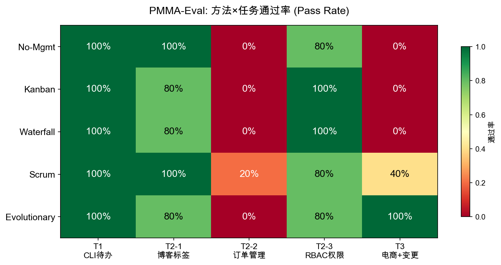
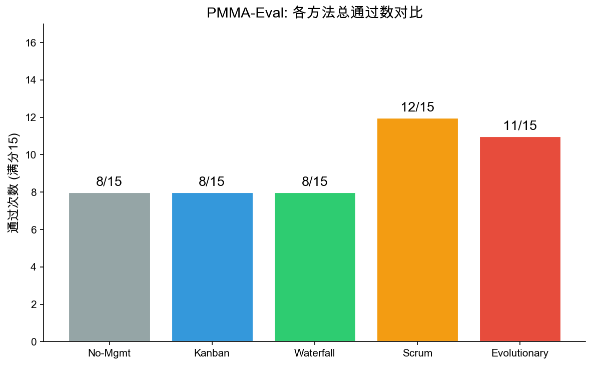
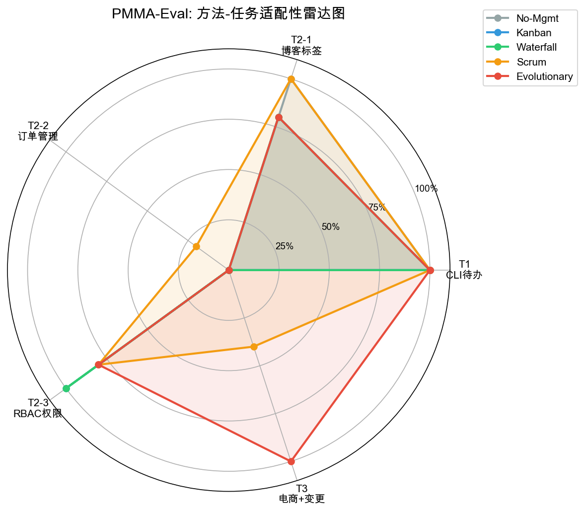

# PMMA-Eval: 数字劳动力项目管理方法评估框架

> **PMMA-Eval** (Project Management Method Assessment for AI Agents) 是一套可复现的实验评估框架，用于系统比较不同项目管理方法在 AI Agent 软件开发任务上的适配性。
>
> 本仓库是复旦大学工程管理硕士（MEM）学位论文 *《面向数字劳动力的项目管理方法适配性分析与实证研究》* 的实验复现材料。

---

## 📊 一句话结论

**不存在"银弹"：** 不同复杂度和变更特征的软件开发任务，需要不同的项目管理方法。Evolutionary PM 在高变更场景（T3）显著优于传统方法，而轻量级方法（No-Mgmt / Kanban）在简单任务上效率最高。

| 方法 | T1 简单 | T2-1 博客 | T2-2 订单 | T2-3 RBAC | T3 电商+变更 | **合计** |
|------|---------|----------|----------|----------|------------|----------|
| **Evolutionary** | 5/5 ✅ | 4/5 ⚠️ | 0/5 ❌ | 4/5 ⚠️ | **5/5 ✅** | **18/25 (72%)** |
| **Scrum** | 5/5 ✅ | 5/5 ✅ | 1/5 ⚠️ | 4/5 ⚠️ | 2/5 ⚠️ | **17/25 (68%)** |
| **Waterfall** | 5/5 ✅ | 4/5 ⚠️ | 0/5 ❌ | 5/5 ✅ | 0/5 ❌ | **14/25 (56%)** |
| **Kanban** | 5/5 ✅ | 4/5 ⚠️ | 0/5 ❌ | 5/5 ✅ | 0/5 ❌ | **14/25 (56%)** |
| **No-Mgmt** | 5/5 ✅ | 5/5 ✅ | 0/5 ❌ | 4/5 ⚠️ | 0/5 ❌ | **14/25 (56%)** |

> 每组 5 次重复运行，表内数字为通过次数。通过率基于 hidden-test 评估（Agent 不可见测试用例）。

---

## 🔬 实验设计

### 研究问题

> 当 AI Agent 承担软件开发任务时，不同项目管理方法（瀑布、Scrum、看板、无管理、演化式 PM）如何影响任务完成质量？方法-任务之间是否存在适配性关系？

### 自变量：5 种项目管理方法

| 方法 | 核心机制 | 代表性实践 |
|------|---------|-----------|
| **No-Mgmt** | 无管理流程，Agent 自由工作 | 无 Sprint、无 Review、无迭代 |
| **Kanban** | WIP 限制 + 持续流动 | 看板拉动、WIP=3 |
| **Waterfall** | 阶段门控 + 顺序执行 | 需求→设计→编码→测试→交付 |
| **Scrum** | 时间盒迭代 + 角色分工 | Sprint、Daily Standup、Retrospective |
| **Evolutionary** | 变异-选择-保留（VSR）循环 | 组织记忆、遗传物质、跨代进化 |

每种方法通过独立的 `SKILL.md` 系统指令模板定义，确保差异来源于管理方法本身，而非 Prompt 风格。

### 因变量：5 个软件开发任务

| 任务 | 复杂度 | 类型 | 需求变更 | 评估方式 |
|------|--------|------|---------|---------|
| **T1 CLI 待办工具** | 低 | 单文件 Python CLI | 无 | pytest |
| **T2-1 博客标签系统** | 中 | Flask Web 应用 | 无 | pytest + flask test |
| **T2-2 订单管理** | 中 | Flask + 数据库 | 无 | pytest + boundary test |
| **T2-3 RBAC 权限** | 中高 | Flask + 角色权限 | 无 | pytest + role test |
| **T3 电商系统** | 高 | 完整电商 + 支付 | **有（中期变更）** | pytest + hidden-test |

任务设计借鉴 [HumanEval](https://github.com/openai/human-eval) 和 [SWE-bench](https://www.swebench.com/) 的思路：
- 提供 **starter code**（基础骨架）+ **README**（需求描述）
- 评估使用 **hidden tests**（Agent 不可见的测试用例），防止"应试"

### 控制变量

| 维度 | 控制方式 |
|------|---------|
| **模型** | 统一使用 GLM-5-Turbo |
| **温度** | Temperature = 0（消除随机性） |
| **任务输入** | 相同的 starter code + README |
| **评估标准** | 相同的 hidden-test 套件 |
| **重复次数** | 每组 5 次独立运行 |

### 实验规模

5 方法 × 5 任务 × 5 重复 = **125 次独立实验**

---

## 🏗️ 框架架构

```
framework/
├── src/                        # TypeScript 实验框架核心
│   ├── index.ts                # CLI 入口
│   ├── experiment-runner.ts    # 实验编排（含 Evolutionary 多代遗传）
│   ├── agent-runner.ts         # 单次 Agent 交互
│   ├── skill-manager.ts        # SKILL.md 模板切换
│   ├── metrics-collector.ts    # Token 统计 + 成本核算
│   ├── test-runner.ts          # pytest 执行 + hidden-test 评估
│   └── ...
├── skill-templates/            # 5 种 PM 方法的 SKILL.md
│   ├── evolutionary/SKILL.md
│   ├── scrum/SKILL.md
│   ├── waterfall/SKILL.md
│   ├── kanban/SKILL.md
│   └── no-mgmt/SKILL.md
├── agent-templates/            # 子 Agent 角色定义
│   ├── developer.md
│   ├── tester.md
│   └── reviewer.md
├── tasks/                      # 5 个任务输入包
│   ├── t1_todo_cli/            # starter/ + tests/ + hidden-tests/
│   ├── t2_blog/
│   ├── t2_order/
│   ├── t2_rbac/
│   └── t3_ecommerce/           # 额外包含 change.md（需求变更）
└── pricing.json                # 模型 token 单价（CNY）
```

### 关键设计决策

1. **SKILL.md 机制**：每种 PM 方法有独立的系统指令文件，Agent 启动时加载，方法差异完全由 SKILL.md 定义
2. **Hidden-test 评估**：测试用例分为 `tests/`（Agent 可见）和 `hidden-tests/`（Agent 不可见），评估使用 hidden-tests
3. **Evolutionary PM 遗传**：多代执行，支持 `geneticMaterial` 跨代传递组织记忆（模式、架构笔记）

---

## 📈 结果总览

### 方法-任务适配性热力图



### 总通过数对比



### 适配性雷达图



### 关键发现

#### 发现 1：管理必要性（Management Necessity）
所有管理方法在 T2-3（RBAC）和 T3（电商）上均优于或等于 No-Mgmt。简单任务不需要管理，复杂任务需要。

#### 发现 2：目标置换效应（Goal Displacement）
Waterfall 在 T3（电商+变更）中，全部 ATU 均被标记为"Done"并获 Reviewer 通过，但 hidden-test 仅 8/18 通过。根本原因：中期变更导致部分需求被 Rate Limiter 功能替换，但原始测试用例未更新 → **过程合规但结果偏离目标**。

#### 发现 3：组织记忆优势
Evolutionary PM 在 T3 的 5 次运行中全部通过 (5/5)，是唯一在 T3 上达到 100% 通过率的方法。部分运行中，ATU-005（库存管理）以 **0 代** 直接通过——它继承了前一次运行积累的遗传物质（编码模式 + 架构笔记），包括来自 ATU-002 的原子 SQL 事务模式。

#### 发现 4：认知启发式偏差
**所有 5 种方法**在 T2-2（订单管理）上均表现不佳（最高 1/5）。根因分析：支付环节缺少"库存二次校验"——这是隐含需求，Agent 普遍采用了"先扣库存再支付"的认知捷径，未考虑并发场景。

#### 发现 5：成本-效果权衡
Evolutionary PM 是唯一在 T3 上 5/5 全通过的方法，但平均 Token 消耗最高。No-Mgmt 最便宜（平均耗时 27-131 秒）但无法处理复杂变更任务。

---

## 🚀 复现指南

### 前置条件

- **Node.js ≥ 18**
- **Python 3** + `flask` `pytest` `pytest-flask`
- API Key（GLM 或 Anthropic）

### 安装

```bash
cd framework/
npm install
npm run build
```

### 运行单次实验

```bash
# Scrum 方法 × T2-1 博客任务 × 第 1 次运行
npm run experiment -- --method scrum --task t2_blog --run 1
```

### 批量运行

```bash
# 串行（有断点续跑）
bash run-matrix.sh

# 并行（MAX_JOBS 控制并发数）
MAX_JOBS=5 bash run-matrix-parallel.sh
```

### 生成图表

```bash
cd results/
python3 generate_charts.py
```

### 统计分析

```bash
cd analysis/
pip install pandas scipy scikit-posthocs
python stats.py
```

---

## 📂 仓库结构

```
pmma-eval/
├── README.md                    ← 你正在读的文件
├── docs/                        ← 实验设计文档
│   ├── 实验设计总表_变量控制_任务集_指标定义.md
│   ├── 五种方法Prompt与系统指令规格草案.md
│   ├── 五种方法统一实验执行协议草案.md
│   ├── 基于HumanEval与SWE-bench思路的正式任务集草案.md
│   └── 实验框架技术方案.md
├── framework/                   ← 可运行的实验框架
│   ├── src/                     （TypeScript 核心代码）
│   ├── skill-templates/         （5 种方法的 SKILL.md）
│   ├── agent-templates/         （子 Agent 角色定义）
│   └── tasks/                   （5 个任务输入包）
├── results/                     ← 实验结果
│   ├── experiment_summary.json  （汇总数据）
│   ├── charts/                  （可视化图表）
│   ├── generate_charts.py       （图表生成脚本）
│   └── {method}_{task}_{run}/   （每次运行的 result.json）
└── analysis/                    ← 统计分析
    └── stats.py                 （Friedman + post-hoc 检验）
```

---

## 📜 License

MIT License — 实验框架和结果数据可自由使用、修改和分发。
